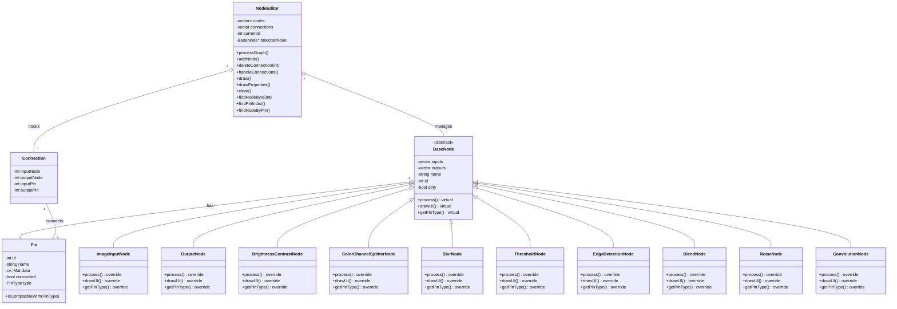

# **Node-Based Image Processor**


An open-source node-based image processing tool designed for creating modular image manipulation workflows. Users can visually connect processing nodes to build complex pipelines with real-time feedback. Built with C++17, OpenCV, and Dear ImGui.

---
## **Technical Documentation**


The above document illustrates the architecture of the Node-Based Image Processor, showcasing the relationships between core components such as `NodeEditor`, `BaseNode`, and derived nodes like `ImageInputNode`, `BlurNode`, and `OutputNode`.

---
## **Project Overview**

The Node-Based Image Processor allows users to:
- Create modular, reusable image processing pipelines.
- Visually connect nodes representing various operations (e.g., Brightness/Contrast, Blur, Edge Detection).
- Process images in real-time with immediate visual feedback.
- Export the final processed images in multiple formats.


---

## **Features Implemented**

### **Core Features**
| Feature Category       | Implemented Operations          |  
|-------------------------|----------------------------------|  
| **Input/Output**        | Image Loading, Image Saving      |  
| **Color Adjustments**   | Brightness/Contrast              |  
| **Filters**             | Gaussian Blur, Median Blur       |  
| **Edge Detection**      | Sobel,Canny, Laplacian           |  
| **Thresholding**        | Binary, Adaptive                 |  
| **Advanced Operations** | Channel Splitting, Noise Generation |  
| **Blend Modes**         | Overlay, Multiply, Screen, Difference       |  

### **Technical Capabilities**
- Dynamic node graph creation/deletion  
- Automatic data type conversion between nodes  
- Input validation for all processing operations  
- Multi-threaded processing pipeline  

---

## **Repository Structure**

```bash
node-based-image-processor/
├── include/               # Header files
│   ├── BaseNode.hpp       # Abstract node interface
│   ├── NodeEditor.hpp     # Graph management logic
│   └── nodes/             # Node-specific headers
│       ├── ImageInputNode.hpp
│       ├── OutputNode.hpp
│       ├── BrightnessContrastNode.hpp
│       ├── ColorChannelSplitterNode.hpp
│       ├── BlurNode.hpp
│       ├── ThresholdNode.hpp
│       ├── EdgeDetectionNode.hpp
│       ├── BlendNode.hpp
│       ├── NoiseNode.hpp
│       └── ConvolutionNode.hpp
├── src/                   # Implementation files
│   ├── main.cpp           # Application entry point
│   ├── NodeEditor.cpp     # Graph processing implementation
│   └── nodes/             # Node operation implementations
│       ├── ImageInputNode.cpp
│       ├── OutputNode.cpp
│       ├── BrightnessContrastNode.cpp
│       ├── ColorChannelSplitterNode.cpp
│       ├── BlurNode.cpp
│       ├── ThresholdNode.cpp
│       ├── EdgeDetectionNode.cpp
│       ├── BlendNode.cpp
│       ├── NoiseNode.cpp
│       └── ConvolutionNode.cpp
├── libs/                  # Third-party dependencies (pfd and others)
├── imgui/                 # Dear ImGui library files for UI rendering
├── imnodes/               # ImNodes library files for node graph functionality
├── CMakeLists.txt         # Build configuration file for CMake
└── README.md              # Project documentation (this file)
```

---

## **Build Instructions**

### **System Requirements**
- **OS**: Windows 10+/macOS 12+/Ubuntu 20.04+  
- **CPU**: x86_64 architecture  
- **RAM**: 4GB+ (8GB recommended for large images)  

### **Dependencies**
```bash  
# Ubuntu/Debian  
sudo apt install build-essential libopencv-dev libglfw3-dev  

# macOS (Homebrew)  
brew install opencv glfw glew  
```

### **Build Process**
```bash  
git clone https://github.com/Shubhammore71/node-based-image-processor
cd node-based-image-processor  
mkdir build && cd build  
cmake .. -DCMAKE_BUILD_TYPE=Release  
make -j$(nproc)  
```

### **Execution**
```bash  
./bin/NodeImageEditor  
```

---

## **Technical Documentation**

### Design Decisions

#### 1. Node-Based Architecture:
- Modular design allows each node to encapsulate a specific operation.
- Input/output pins define explicit data flow between nodes.
- Extensible structure enables easy addition of new operations.

#### 2. Immediate Mode GUI:
- Built using Dear ImGui and ImNodes for rapid prototyping and flexibility.
- Efficient rendering suitable for real-time updates.

#### 3. Image Processing Core:
- Powered by OpenCV for fast, hardware-accelerated operations.
- Supports multi-threaded execution for performance optimization.

#### 4. Memory Management:
- Smart pointers (`std::unique_ptr`) ensure safe resource handling.
- OpenCV's `cv::Mat` handles image data efficiently with reference counting.

---

### Class Diagram



---

## **Third-Party Libraries**

| Library      | Version | Purpose                          | Selection Rationale                   |
|--------------|---------|----------------------------------|----------------------------------------|
| OpenCV       | 4.11.0  | Image processing core            | Industry-standard CV library           |
| Dear ImGui   | 1.89    | User interface                   | Immediate-mode GUI for rapid prototyping |
| ImNodes      | 0.5     | Node graph system                | Tight integration with ImGui            |
| GLFW         | 3.3.8   | Window management                | Cross-platform OpenGL context handling |
| GLEW         | 2.2.0   | OpenGL extension loading         | Simplifies OpenGL feature usage         |

---

## **Features Implemented**

1. Real-time image processing with modular nodes.
2. Dynamic node graph creation with drag-and-drop connections.
3. Support for common image operations like blur, thresholding, and blending.
4. Debugging tools to visualize connections and processing order.
5. Export functionality to save processed images.


---

