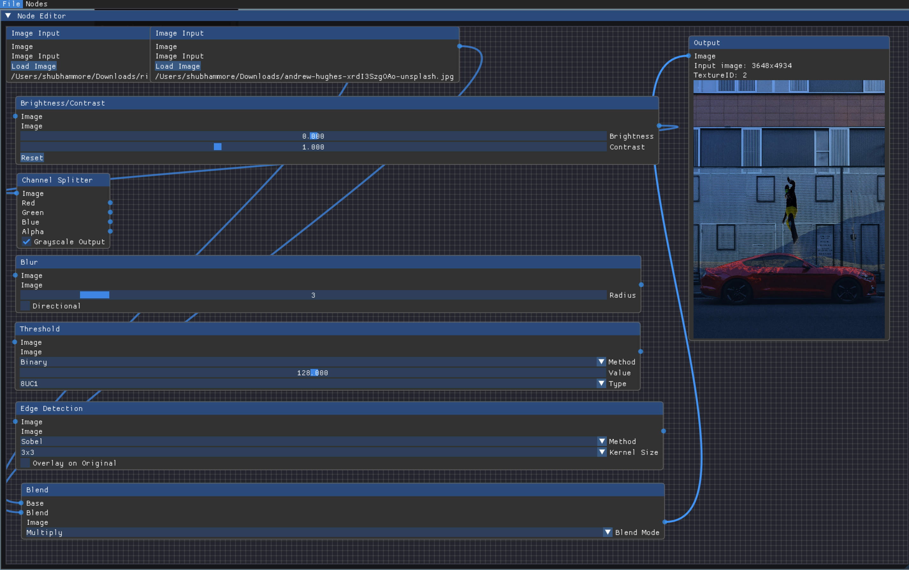

# Node-Based Image Processor



An open-source **node-based image processing editor** built with **C++**, **OpenCV**, and **Dear ImGui**. This project enables users to build complex image processing pipelines using a visual, interactive editor. Designed with real-time feedback, flexibility, and extensibility in mind.

---

## ✨ Key Features

- 🧩 Node-based visual workflow
- 🖼️ Real-time image preview and feedback
- 🧠 Intelligent memory and resource management
- 🔧 Multiple image operation nodes (filters, blending, noise, thresholding)
- 💻 Cross-platform (macOS/Linux/Windows with some adjustments)

---

## 📁 Table of Contents

- [Installation](#installation)
- [Usage](#usage)
- [Features](#features)
- [Node Documentation](#node-documentation)
  - [Basic Nodes](#basic-nodes)
  - [Intermediate Nodes](#intermediate-nodes)
  - [Advanced Nodes](#advanced-nodes)
- [Memory Management](#memory-management)
- [Contributing](#contributing)
- [License](#license)

---

## 🔧 Installation

### 🧱 Prerequisites

- macOS (tested on Ventura 13.4+)
- Xcode Command Line Tools
- Homebrew package manager

### 🛠️ Build Steps

```bash
# Install dependencies
brew install opencv glfw glew

# Clone the repository
git clone https://github.com/Shubhammore71/node-based-image-processor.git
cd node-based-image-processor

# Build the project
mkdir build && cd build
cmake .. -DCMAKE_BUILD_TYPE=Release
make -j4

# Run the application
./bin/NodeImageEditor
```

---

## 🚀 Usage

### Basic Workflow

1. **Add Nodes** – Right-click > Add Node
2. **Connect Nodes** – Drag from output pin to input pin
3. **Adjust Parameters** – Use property panel
4. **Live Preview** – Output updates in real-time
5. **Export** – Right-click on Output Node > Save Image

### ⌨️ Keyboard Shortcuts

- `Ctrl + N` – New Project
- `Ctrl + S` – Save Project
- `Del` – Delete Selected Node
- `Double Click` – Remove Connections

---

## 🌟 Features

### 🧠 Core Architecture

- Modular and extendable node system
- Multi-threaded processing
- Node alignment, snapping, and scaling
- Context-aware UI with Dear ImGui

### 📁 File Support

- **Input**: JPG, PNG, BMP, TIFF
- **Output**: PNG, JPEG, OpenEXR
- **Projects**: `.nbip` custom format

---

## 🧱 Node Documentation

### 📦 Basic Nodes

#### 1. **Image Input Node**
- Load image from filesystem
- Show metadata (resolution, file size, format)
- Format support: JPG, PNG, BMP
- Outputs: `cv::Mat`

#### 2. **Output Node**
- Export final image to disk
- Preview area
- Format selection: PNG, JPEG, etc.
- Resolution & compression control

#### 3. **Brightness/Contrast Node**
- Brightness slider: -100 to +100
- Contrast slider: 0.0 to 3.0
- Reset buttons
- Histogram visualization

#### 4. **Color Channel Splitter**
- Splits RGB/RGBA into channels
- Outputs grayscale channels (R, G, B, A)
- Option for individual channel processing

---

### ⚙️ Intermediate Nodes

#### 5. **Blur Node**
- Gaussian blur with adjustable radius (1–20 px)
- Directional blur toggle
- Preview kernel for learning

#### 6. **Threshold Node**
- Convert to binary based on threshold value
- Thresholding modes: Binary, Adaptive, Otsu
- Histogram display for analysis

#### 7. **Edge Detection Node**
- Sobel and Canny algorithms
- Adjustable kernel size & thresholds
- Overlay edges on original image

#### 8. **Blend Node**
- Combine two image streams
- Blend modes: Normal, Multiply, Screen, Overlay, Difference
- Opacity slider

---

### 🧪 Advanced Nodes

#### 9. **Noise Generation Node**
- Procedural noise types: Perlin, Simplex, Worley
- Customizable parameters (scale, octaves, persistence)
- Use as displacement or color input

#### 10. **Convolution Filter Node**
- Custom 3x3 or 5x5 matrix kernel
- Presets: Sharpen, Emboss, Edge Enhance
- Real-time visual feedback

---

## 🧠 Memory Management

### 🛡️ Key Strategies

- **Smart Pointers** for all dynamic nodes
  ```cpp
  std::vector<std::shared_ptr<Node>> nodes;
  ```
- **OpenCV `cv::Mat`** automatic ref-counting
- **Manual OpenGL cleanup**
  ```cpp
  glDeleteTextures(1, &textureID);
  ```
- **Automatic disconnection & cleanup** on node removal

### 🧪 Leak Prevention

- RAII for all major objects
- Thread-safe memory access
- Matrix boundary validations
- Debug Mode: `DEBUG_MEMORY=1`

---


## 📷 Screenshot


---

## 🌐 Repository

**GitHub**: [https://github.com/Shubhammore71/node-based-image-processor](https://github.com/Shubhammore71/node-based-image-processor)
```


